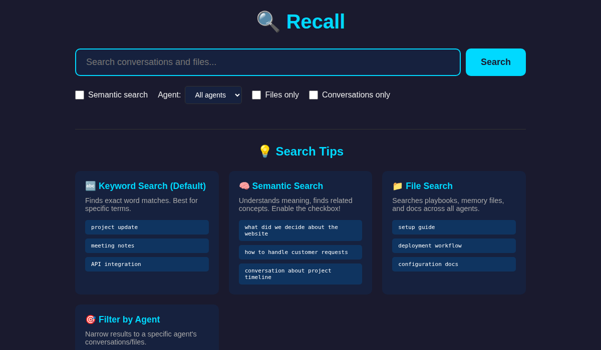

# 🔍 Claw Recall

**Searchable conversation memory for OpenClaw agents.**

Ever had your agent forget something important? Context compaction means your agent loses access to older conversations. Claw Recall fixes that — giving your agent the ability to search through ALL your past conversations, not just what's in the current context window.

## 📑 Contents

- [Using It With Your Bot](#using-it-with-your-bot-telegram-discord-etc) — Ask your bot naturally, get answers from past conversations
- [Web Interface](#web-interface) — Visual search with highlighting
- [CLI Usage](#cli-usage) — Command-line for power users
- [Installation](#installation) — Setup in 5 steps
- [Why You Need This](#why-you-need-this) — The compaction problem explained
- [How It Works](#how-it-works) — Technical overview
- [Multi-Agent Setup](#multi-agent-setup) — Shared database for teams
- [Roadmap](#roadmap--future-enhancements) — What's coming next

---

## Using It With Your Bot (Telegram, Discord, etc.)

This is how most people will use Claw Recall — just ask your bot!


### Example Prompts

Just talk to your bot naturally:

- "What did we discuss about the website redesign last month?"
- "Can you find that conversation where we decided on the budget?"
- "Remind me what we talked about with the API integration"
- "Search our history for anything about project X"

Your bot will search through ALL your archived conversations and summarize what it finds — **including the dates** of those conversations.

### ⚠️ Important: Teach Your Bot About Recall

**Your bot won't automatically know about Claw Recall.** You must tell it!

**Option A: Automatic Setup (Recommended)**

Run the install script to automatically add Recall to your TOOLS.md:

```bash
./install.sh ~/clawd/TOOLS.md
```

**Option B: Manual Setup**

Add this to your agent's `TOOLS.md` or `AGENTS.md`:

```markdown
## 🦞 Claw Recall — Conversation Memory Search

Search past conversations that are no longer in your context window.

**Location:** `~/tools/recall/` (or wherever you installed it)

**When to use:** When the user asks about past conversations, decisions, or context that might have been compacted away.

**How to search:**
\`\`\`bash
cd ~/tools/recall && ./recall.py "search terms"
cd ~/tools/recall && ./recall.py "conceptual question" --semantic
\`\`\`
```

That's it! Your bot will now use Claw Recall when you ask about past conversations.

**Option C: Add to MEMORY.md (Strongest)**

The most reliable way to ensure your bot uses Recall is to add search rules directly to your `MEMORY.md` (or equivalent long-term memory file). This gets loaded every session:

```markdown
## Memory Search Rules

**When I'm asked about ANYTHING I'm not 100% sure about, ALWAYS search before answering:**
1. First: `memory_search` (searches MEMORY.md + memory/*.md)
2. If not found: Claw Recall (`cd ~/shared/convo-memory && ./claw-recall "query"`) — searches ALL conversation history
3. If still not found: tell the user I checked both and couldn't find it, ask for clarification

**Triggers to search (not exhaustive):**
- "Remember when we..." / "What did we decide about..." / "Didn't we already..."
- Any reference to a past conversation, decision, or project I don't have loaded
- Names, IDs, or terms I don't immediately recognize
- When the user seems surprised I don't know something

**Never say "I don't have context on that" without searching first.**
```

This is important because agents can be "lazy" about searching — they'll sometimes say "I don't have that context" when the answer is sitting right there in the conversation history. Adding it to MEMORY.md makes the search behaviour a core part of the agent's identity, not just a tool it might forget to use.

---

## Web Interface

For browsing and exploring your conversation history visually:



```bash
python web.py --port 8765
# Open http://localhost:8765
```

Features:
- Search with result highlighting
- Toggle semantic search
- Filter by agent
- Click 🔗 to jump to original Discord messages

---

## CLI Usage

For power users and scripting:

```bash
# Basic keyword search
./recall.py "project budget"

# Semantic search (finds related concepts)
./recall.py "how did we handle that customer issue" --semantic

# Filter by agent
./recall.py "playbook" --agent cyrus

# Search only files (skip conversations)
./recall.py "RUNBOOK" --files-only

# Search only conversations (skip files)
./recall.py "meeting notes" --convos-only
```

---

## Installation

### 1. Clone & Install

```bash
git clone https://github.com/rodbland2021/claw-recall.git
cd claw-recall
pip install -r requirements.txt
```

### 2. Configure (Optional — for Semantic Search)

```bash
cp .env.example .env
# Edit .env and add your OPENAI_API_KEY
```

Semantic search uses OpenAI embeddings (~$0.02 for 30K messages). Without it, you still get fast keyword search.

### 3. Create Database & Index

```bash
# Create the database
python setup_db.py

# Index your archived conversations
python index.py --source ~/.openclaw/agents-archive/

# Optional: Generate embeddings for semantic search
python index.py --source ~/.openclaw/agents-archive/ --embeddings
```

### 4. Make It Accessible to Your Agent

```bash
# Option A: In your agent's workspace
cp -r claw-recall ~/clawd/tools/recall/

# Option B: Shared location (for multi-agent setups)
mkdir -p ~/shared
cp -r claw-recall ~/shared/convo-memory/
ln -s ~/shared/convo-memory ~/clawd/shared/convo-memory
```

### 5. Keep It Updated

Set up automatic indexing so new conversations are searchable.

**Option A: OpenClaw Cron (Recommended)**

Add a cron job in your OpenClaw config to run the indexer regularly:

```json
{
  "name": "convo-memory-index",
  "schedule": { "kind": "every", "everyMs": 900000 },
  "sessionTarget": "main",
  "wakeMode": "next-heartbeat",
  "payload": {
    "kind": "systemEvent",
    "text": "Run quick index on convo-memory database: bash ~/shared/convo-memory/hooks/quick-index.sh"
  }
}
```

This runs every 15 minutes and indexes both archived and active sessions.

**Option B: System Crontab**

```bash
# Add to crontab (crontab -e)

# Index every 15 min (with embeddings for semantic search)
*/15 * * * * /bin/bash ~/repos/claw-recall/hooks/quick-index.sh >> /tmp/recall-index.log 2>&1

# Optional: Sync archives from remote installations hourly (see Cross-Installation Search)
0 * * * * /bin/bash ~/repos/claw-recall/hooks/sync-archives.sh
```

### Index Options

```bash
# Index only archived sessions (default)
python3 index.py --source ~/.openclaw/agents-archive/

# Also index active/live sessions (recommended)
python3 index.py --source ~/.openclaw/agents-archive/ --include-active

# Generate embeddings for semantic search
python3 index.py --source ~/.openclaw/agents-archive/ --include-active --embeddings
```

The `--include-active` flag indexes current, in-progress sessions from `~/.openclaw/agents/*/sessions/` so your agent can search conversations that haven't been archived yet.

---

## Why You Need This

### The Problem: Compaction Erases Memory

OpenClaw agents have a limited context window. When conversations get too long, the system **compacts** them — summarizing older messages to make room for new ones. This means:

- ❌ Specific details from last week's conversation? Gone.
- ❌ That decision you made about project X? Summarized away.
- ❌ The exact steps you worked through together? Lost in compaction.

### What OpenClaw Already Has (and What's Missing)

OpenClaw **does** have a built-in `memory_search` tool that searches:
- ✅ Current session files in `~/.openclaw/agents/*/sessions/`
- ✅ Markdown files in your workspace (MEMORY.md, memory/*.md, etc.)

**But here's the gap:** When sessions are archived to `~/.openclaw/agents-archive/`, the built-in tool **can't search them anymore**. Those archives become invisible to your agent.

In a typical setup:
- Current sessions: ~50-100 MB (recent conversations)
- Archived sessions: **500+ MB** (weeks/months of history) ← *unsearchable without Claw Recall!*

---

## How It Works

1. **Indexing:** Reads archived JSON sessions and extracts messages into SQLite
2. **Keyword Search:** Uses FTS5 full-text search for fast exact matching (~0.5s)
3. **Semantic Search:** OpenAI embeddings find conceptually related content (~2s)
4. **File Search:** Also scans markdown/text files across your workspaces

---

## Multi-Agent Setup

If you have multiple agents on the **same machine**, point them all to a shared database:

```bash
# Shared location
mkdir -p ~/shared/convo-memory
cp -r claw-recall/* ~/shared/convo-memory/

# Symlink from each agent workspace
ln -s ~/shared/convo-memory ~/clawd/shared/convo-memory
ln -s ~/shared/convo-memory ~/clawd-cyrus/shared/convo-memory
```

Now all agents search the same database.

### Cross-Installation Search (Multiple Machines)

If you run OpenClaw on multiple machines (e.g. a local PC and a VPS), you can sync archived sessions between them using `rsync` so each installation can search the other's conversations.

**1. Set up the sync script:**

The included `hooks/sync-archives.sh` does bidirectional rsync:

```bash
# VPS → Local (pulls remote agent's archives)
rsync -az vps:~/.openclaw/agents-archive/ ~/.openclaw/agents-archive-vps/

# Local → VPS (pushes your archives to remote)
rsync -az ~/.openclaw/agents-archive/ vps:~/.openclaw/agents-archive-claude/
```

Customize the SSH alias (`vps`) and paths for your setup. The script logs to `/tmp/recall-sync.log`.

**2. Add cron jobs:**

```bash
# Sync archives hourly
0 * * * * /bin/bash ~/repos/claw-recall/hooks/sync-archives.sh

# Index everything every 15 min (local + synced remote archives)
*/15 * * * * /bin/bash ~/repos/claw-recall/hooks/quick-index.sh >> /tmp/recall-index.log 2>&1
```

**3. Update quick-index.sh on each machine:**

The indexer automatically picks up synced archives if the directory exists:

```bash
# Index local archives + active sessions
python3 index.py --source ~/.openclaw/agents-archive/ --include-active --incremental --embeddings

# Index remote archives (synced by sync-archives.sh)
if [ -d ~/.openclaw/agents-archive-vps ]; then
    python3 index.py --source ~/.openclaw/agents-archive-vps/ --incremental --embeddings
fi
```

Now both machines have full cross-agent, cross-installation search. Ask your local agent about conversations you had with your VPS agent — and vice versa.

### Cross-Agent Search Example

You can ask one agent to find conversations you had with a different agent:

**You to Kit:** "What did I discuss with Cyrus about the YouTube workflow last week?"

**Kit searches:** `./recall.py "YouTube workflow" --semantic`

**Kit responds:**
> I searched our conversation history and found relevant discussions with **Cyrus** (not me):
>
> On **February 3rd**, you and Cyrus discussed the YouTube Shorts workflow. Cyrus set up a 10-step pipeline: retention analysis → extract → crop → transcribe → captions → upload.
>
> On **February 5th**, Cyrus uploaded 4 clips from the Darius Wright interview to the UC Clips channel.
>
> Want me to search for more details, or should I ask Cyrus directly?

The search results show which agent the conversation was with:

```
#1 | cyrus | discord | 2026-02-03T08:30
   [assistant] Here's the YouTube Shorts workflow I set up...

#2 | cyrus | discord | 2026-02-05T14:22  
   [assistant] Uploaded 4 clips from Darius Wright interview...

#3 | main | direct | 2026-02-02T10:30
   [user] Can you check what Cyrus has been working on?
```

The `cyrus` and `main` labels tell you which agent was involved in each conversation.

---

## Configuration

### OpenClaw TOOLS.md / AGENTS.md

For best results, add memory search rules to your agent's AGENTS.md or MEMORY.md:

```markdown
## Memory Search Rules

**When the user asks about ANYTHING you're not 100% sure about, ALWAYS search before answering:**
1. First: `memory_search` (searches MEMORY.md + memory/*.md)
2. If not found: Claw Recall (`cd ~/shared/convo-memory && ./claw-recall "query"`)
3. If still not found: tell the user you checked both and couldn't find it

**Never say "I don't have context on that" without searching first.**
```

This ensures your agent proactively searches conversation history instead of just saying "I don't know."

### Environment Variables

| Variable | Required | Description |
|----------|----------|-------------|
| `OPENAI_API_KEY` | No | Enables semantic search via embeddings |
| `CLAW_RECALL_DB` | No | Custom path to SQLite database (default: `./convo_memory.db`) |

### Search Modes

Claw Recall auto-detects the best search mode based on your query:

| Query Type | Mode | Example |
|-----------|------|---------|
| Short terms, IDs | Keyword | `"LYFER"`, `"act_12345"` |
| Natural language questions | Semantic | `"what did we discuss about playbooks"` |
| Mixed | Hybrid | `"Facebook ads campaign setup"` |

You can force a mode with `--keyword` or `--semantic` flags.

## Roadmap / Future Enhancements

- [x] **Active session indexing** — Index live sessions, not just archives
- [x] **Cross-installation search** — Sync archives between machines via rsync for full cross-agent search
- [x] **Cron-based indexing with embeddings** — Automated 15-min incremental indexing with semantic embeddings
- [ ] **Deep linking to original messages** — Click search results to jump back to the original Telegram/Discord message (platform-dependent, WhatsApp/Signal don't support this)
- [ ] **Embeddings caching** — Skip re-embedding unchanged messages
- [ ] **Multi-user support** — Separate databases per user/workspace

PRs welcome! 🦞

---

## Requirements

- Python 3.10+
- SQLite 3.35+ (included with Python)
- OpenAI API key (optional, for semantic search)

## License

MIT — Use freely, modify as needed.

## Credits

Built for the [OpenClaw](https://github.com/openclaw/openclaw) community.

---

**Questions?** Open an issue or find us on [Discord](https://discord.com/invite/clawd).
