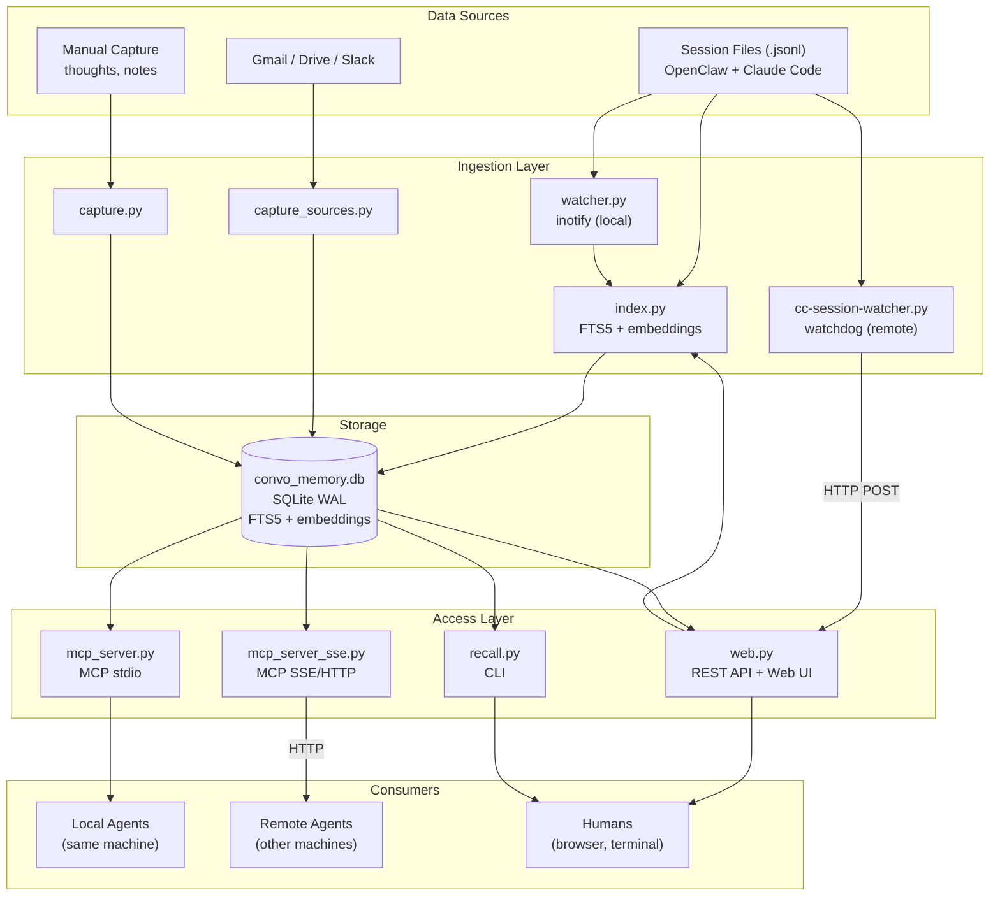

# Claw Recall

**Searchable conversation memory for AI agents.**

Claw Recall gives your AI agents the ability to search through ALL past conversations — not just what's in the current context window. When context compaction erases memory, Claw Recall brings it back.

## What It Does

- **Indexes** all agent conversations (OpenClaw + Claude Code sessions) into a searchable SQLite database
- **Searches** by keyword (FTS5) or meaning (semantic via OpenAI embeddings)
- **Captures** external sources: Gmail, Google Drive, Slack
- **Recovers context** after compaction/restart with `browse_recent` (full transcript, no search query needed)
- **Serves** results via CLI, REST API, MCP (stdio + SSE), and a web UI

## Quick Start

```bash
git clone https://github.com/rodbland2021/claw-recall.git
cd claw-recall
pip install -r requirements.txt

# Create the database
python3 setup_db.py

# Index your conversations
python3 index.py --source ~/.openclaw/agents-archive/ --incremental --embeddings

# Search
./recall.py search "what did we discuss about the API integration"

# Start the web UI
python3 web.py --host 127.0.0.1 --port 8765
```

## Architecture


```mermaid
flowchart TB
    subgraph Sources["Data Sources"]
        JSONL["Session Files (.jsonl)<br/>OpenClaw + Claude Code"]
        EXT["Gmail / Drive / Slack"]
        MANUAL["Manual Capture<br/>thoughts, notes"]
    end

    subgraph Ingestion["Ingestion Layer"]
        IDX["index.py<br/>FTS5 + embeddings"]
        CAP["capture_sources.py"]
        CAPMAN["capture.py"]
        WATCH["watcher.py<br/>inotify (local)"]
        REMWATCH["cc-session-watcher.py<br/>watchdog (remote)"]
    end

    subgraph Storage["Storage"]
        DB[("convo_memory.db<br/>SQLite WAL<br/>FTS5 + embeddings")]
    end

    subgraph Access["Access Layer"]
        CLI["recall.py<br/>CLI"]
        WEB["web.py<br/>REST API + Web UI"]
        MCP_STDIO["mcp_server.py<br/>MCP stdio"]
        MCP_SSE["mcp_server_sse.py<br/>MCP SSE/HTTP"]
    end

    subgraph Consumers["Consumers"]
        LOCAL_AGENT["Local Agents<br/>(same machine)"]
        REMOTE_AGENT["Remote Agents<br/>(other machines)"]
        HUMAN["Humans<br/>(browser, terminal)"]
    end

    JSONL --> IDX
    JSONL --> WATCH --> IDX
    JSONL --> REMWATCH -->|HTTP POST| WEB --> IDX
    EXT --> CAP
    MANUAL --> CAPMAN

    IDX --> DB
    CAP --> DB
    CAPMAN --> DB

    DB --> CLI
    DB --> WEB
    DB --> MCP_STDIO
    DB --> MCP_SSE

    MCP_STDIO --> LOCAL_AGENT
    MCP_SSE -->|HTTP| REMOTE_AGENT
    WEB --> HUMAN
    CLI --> HUMAN
```

**Three ways agents access Claw Recall:**

| Transport | Use Case | Config |
|-----------|----------|--------|
| **MCP stdio** | Agents on the same machine | `python3 mcp_server.py` |
| **MCP SSE** | Agents on remote machines | `python3 mcp_server_sse.py` → `http://host:8766/sse` |
| **REST API** | Scripts, web UI, anything HTTP | `python3 web.py` → `http://host:8765/` |

## MCP Integration

Claw Recall is an MCP server with **8 tools**:

| Tool | Description |
|------|-------------|
| `search_memory` | Full unified search — conversations, files, thoughts. Auto-detects keyword vs semantic. |
| `search_thoughts` | Search captured thoughts only |
| `capture_thought` | Save a note/observation to memory |
| `browse_recent` | Full transcript of last N minutes — **the primary context recovery tool** |
| `browse_activity` | Session summaries (who talked when) |
| `memory_stats` | Database statistics |
| `poll_sources` | Trigger Gmail/Drive/Slack polling |
| `capture_source_status` | External source capture stats |

### Setup: Local Agent (stdio)

For agents running on the same machine as the database:

```json
{
  "mcpServers": {
    "claw-recall": {
      "command": "python3",
      "args": ["/path/to/claw-recall/mcp_server.py"]
    }
  }
}
```

### Setup: Remote Agent (SSE over HTTP)

For agents on a different machine (e.g. desktop connecting to a server):

**1. Start the SSE server:**
```bash
MCP_SSE_HOST=0.0.0.0 python3 mcp_server_sse.py
```

**2. Configure the remote agent:**
```json
{
  "mcpServers": {
    "claw-recall": {
      "url": "http://your-server:8766/sse"
    }
  }
}
```

This is the most robust approach for remote agents — HTTP is stateless, survives sleep/wake cycles, and has no persistent connections to break.

### Context Recovery After Compaction

When an agent's context is compacted or reset, it loses all recent conversation details. `browse_recent` solves this:

```
mcp__claw-recall__browse_recent agent=myagent minutes=30
```

Returns the full transcript of the last 30 minutes — no search query needed. This is the recommended first step in any post-compaction recovery workflow.

## CLI Usage

```bash
# Search (auto-detects keyword vs semantic)
./recall.py search "what did we discuss about playbooks"
./recall.py search "LYFER" --keyword
./recall.py search "budget decisions" --agent cyrus --since 2h

# Browse recent transcripts (no search query)
./recall.py recent --agent kit --minutes 30
./recall.py recent --minutes 120    # All agents, last 2 hours

# Capture a thought
./recall.py capture "API rate limit is 100/min" --source manual

# Date range search
./recall.py search "deployment" --from 2026-02-15 --to 2026-02-17

# Output as JSON (for scripting)
./recall.py search "topic" --json
```

### CLI Flags

| Flag | Description |
|------|-------------|
| `--agent` / `-a` | Filter by agent name |
| `--semantic` / `-s` | Force semantic search |
| `--keyword` / `-k` | Force keyword search |
| `--since` | Recent: `60m`, `2h`, `3d` |
| `--from` / `--to` | Date range: `YYYY-MM-DD` |
| `--files-only` / `-f` | Only search markdown files |
| `--convos-only` / `-c` | Only search conversations |
| `--limit` / `-n` | Max results per category |
| `--json` / `-j` | Output as JSON |

## REST API

Start with `python3 web.py --host 127.0.0.1 --port 8765`.

| Endpoint | Method | Description |
|----------|--------|-------------|
| `/search?q=...` | GET | Unified search |
| `/recent?minutes=30&agent=kit` | GET | Full transcript of last N minutes |
| `/capture` | POST | Capture a thought |
| `/capture/poll` | POST | Trigger Gmail/Drive/Slack poll |
| `/capture/status` | GET | Capture log statistics |
| `/thoughts` | GET | List/search thoughts |
| `/status` | GET | System status |
| `/agents` | GET | Agent list with session counts |
| `/activity` | GET | Recent conversations (summaries) |
| `/context` | GET | Surrounding messages for a message |
| `/session` | GET | Full session with windowed loading |
| `/index-session` | POST | Upload + index a session file (for remote watchers) |
| `/index-local` | POST | Index a local session file by path |

## Web Interface

The built-in web UI at `http://localhost:8765` provides:
- Search with result highlighting
- Semantic search toggle
- Agent filtering
- Conversation viewer with context expansion
- Deep links to Discord messages

## Data Ingestion

### Automatic: Conversation Indexing

Claw Recall indexes `.jsonl` session files from two sources:

- **OpenClaw sessions** — `~/.openclaw/agents/` (active) and `~/.openclaw/agents-archive/` (completed)
- **Claude Code sessions** — `~/.claude/projects/` (automatic format detection)

**Real-time indexing** (recommended): Run `watcher.py` as a service. It uses inotify to detect changes instantly:
```bash
python3 watcher.py
```

**Cron-based indexing** (alternative):
```bash
# Every 15 minutes
*/15 * * * * cd /path/to/claw-recall && python3 index.py --source ~/.openclaw/agents-archive/ --incremental --embeddings
```

### Remote Machine Indexing

For agents running on a different machine (e.g. desktop), the included `cc-session-watcher.py` monitors local session files and pushes them to the server in real-time via HTTP:

```bash
pip3 install watchdog requests
python3 cc-session-watcher.py
```

Configure the SSH tunnel settings in the script's configuration section.

### External Sources

```bash
python3 capture_sources.py gmail           # Poll Gmail (both accounts)
python3 capture_sources.py drive           # Poll Google Drive
python3 capture_sources.py slack           # Poll Slack
python3 capture_sources.py all             # All sources
python3 capture_sources.py gmail --backfill --days 90   # Historical backfill
```

## Multi-Agent Setup

Point all agents at the same database:
```bash
mkdir -p ~/shared/convo-memory
ln -s /path/to/claw-recall/convo_memory.db ~/shared/convo-memory/convo_memory.db
```

Cross-machine search: use `hooks/sync-archives.sh` to rsync session files between machines, or use the real-time watcher (`cc-session-watcher.py`).

## Health Monitoring

The included `health-check.sh` monitors service availability:

- **MCP SSE service** — active and responding to HTTP requests
- **Web API service** — active and returning valid responses
- **Watcher service** — running (for real-time indexing)
- **Indexing pipeline** — context-aware check (only alerts if modified session files exist but indexing hasn't run)

Run it via cron:
```bash
*/15 * * * * /bin/bash /path/to/claw-recall/health-check.sh
```

Configure the URLs, alert method, and paths in the script's configuration section.

## Search Modes

Claw Recall auto-detects the best search mode:

| Query Type | Mode | Example |
|-----------|------|---------|
| Short terms, IDs | Keyword | `"LYFER"`, `"act_12345"` |
| Questions | Semantic | `"what did we discuss about playbooks"` |
| Quoted phrases | Keyword | `"exact phrase"` |
| File paths | Keyword | `~/repos/claw-recall/` |

Force a mode with `--keyword` or `--semantic` flags.

## Configuration

### Environment Variables

| Variable | Required | Description |
|----------|----------|-------------|
| `OPENAI_API_KEY` | For semantic search | Enables embeddings (~$0.02 per 30K messages) |
| `CLAW_RECALL_DB` | No | Custom path to SQLite database (default: `./convo_memory.db`) |
| `CLAW_RECALL_AGENT_DIRS` | No | Colon-separated list of agent workspace directories to search for files |
| `CLAW_RECALL_REMOTE_HOME` | No | Home directory of remote machine (for agent detection in pushed files) |
| `MCP_SSE_HOST` | No | SSE server bind host (default: `0.0.0.0`) |
| `MCP_SSE_PORT` | No | SSE server bind port (default: `8766`) |
| `MCP_SSE_ALLOWED_HOSTS` | No | Extra allowed hosts for SSE (comma-separated) |

## Database

SQLite with WAL mode. Tables:

| Table | Purpose |
|-------|---------|
| `sessions` | Conversation session metadata |
| `messages` | Individual messages (FTS5 indexed) |
| `embeddings` | Message embeddings (text-embedding-3-small, 1536-dim) |
| `thoughts` | Captured notes, emails, docs |
| `capture_log` | External source ingestion tracking |
| `index_log` | Session file indexing tracking |

## Components

| File | Purpose |
|------|---------|
| `recall.py` | CLI entry point — search, browse recent, capture |
| `search.py` | Conversation search engine (FTS5 + semantic) |
| `search_files.py` | Markdown file search across agent workspaces |
| `capture_sources.py` | Gmail, Google Drive, and Slack polling |
| `web.py` | Flask REST API + web UI |
| `mcp_server.py` | MCP server (stdio transport) |
| `mcp_server_sse.py` | MCP server (SSE/HTTP transport) |
| `index.py` | Session file indexer with embedding generation |
| `watcher.py` | Real-time inotify watcher for session files |
| `cc-session-watcher.py` | Remote machine watcher (pushes files via HTTP) |
| `health-check.sh` | Service health monitoring with alerting |
| `setup_db.py` | Database schema and migrations |

## Testing

```bash
python3 -m pytest test_claw_recall.py -v           # All tests
python3 -m pytest test_claw_recall.py -k browse     # Browse recent tests
python3 -m pytest test_claw_recall.py -k search     # Search tests
python3 -m pytest test_claw_recall.py -k mcp        # MCP tests
```

## Requirements

- Python 3.10+
- SQLite 3.35+ (included with Python)
- OpenAI API key (optional, for semantic search)
- `pip install -r requirements.txt` (Flask, numpy, openai, watchdog, mcp)

## License

MIT — Use freely, modify as needed.

Built for the [OpenClaw](https://github.com/openclaw/openclaw) community.
