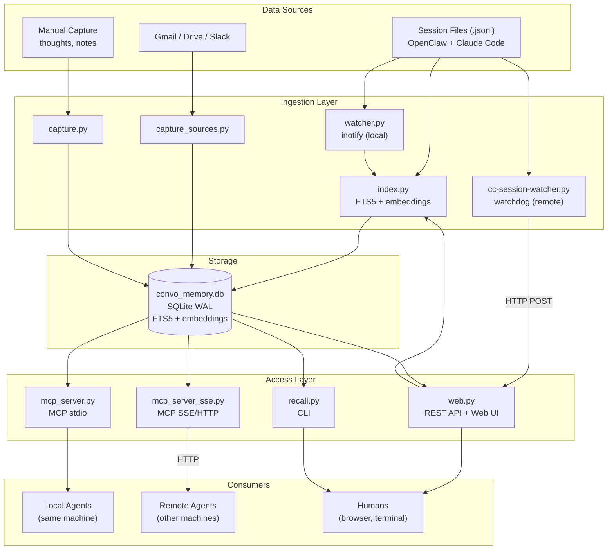

# Claw Recall

[](https://discord.gg/4wGTVa9Bt6)
[](LICENSE)
[](CHANGELOG.md)

**Searchable conversation memory for AI agents.** · [Changelog](CHANGELOG.md) · [Discord](https://discord.gg/4wGTVa9Bt6)

Claw Recall gives your AI agents the ability to search through ALL past conversations — not just what's in the current context window. When context compaction erases memory, Claw Recall brings it back.

## What It Does

- **Indexes** all agent conversations (OpenClaw + Claude Code sessions) into a searchable SQLite database
- **Searches** by keyword (FTS5) or meaning (semantic via OpenAI embeddings)
- **Captures** external sources: Gmail, Google Drive, Slack
- **Recovers context** after compaction/restart with `browse_recent` (full transcript, no search query needed)
- **Serves** results via CLI, REST API, MCP (stdio + SSE), and a web UI

## Use Cases

### Post-Compaction Recovery
Your agent just had its context compacted and lost the details of what it was working on 10 minutes ago. Instead of asking you to repeat everything:
```bash
recall --recent --agent kit --minutes 30
# Returns the full transcript — agent reads it and picks up where it left off
```

### Cross-Agent Context
Agent A is working on a feature but needs to know what Agent B decided yesterday about the database schema:
```bash
recall -q "database schema migration" --agent cc --days 2
# Finds the exact conversation where the decision was made
```

### "What Did We Decide?"
You discussed something with your agent last week but can't remember the outcome. Your agent searches for it:
```bash
recall -q "TikTok campaign budget" --days 7
# Surfaces the conversation with the decision, including the reasoning
```

### Finding Past Solutions
Your agent hits an error it's seen before. Instead of debugging from scratch:
```bash
recall -q "CORS error oauth proxy" --semantic
# Semantic search finds related conversations even if the exact words differ
```

### Email and Document Search
You need your agent to find that email from last month about the shipping delay:
```bash
recall -q "shipping delay January" --files-only
# Searches indexed Gmail and Drive documents alongside conversations
```

### Onboarding a New Agent
A new agent joins your setup and needs to understand existing context:
```bash
recall --activity --days 7
# Shows what all agents have been working on across the past week
```

### Capturing Insights
Your agent learns something important that should survive any future compaction:
```bash
recall --capture "SQLite WAL mode must be enabled before any concurrent reads"
# Stored as a searchable thought, retrievable by any agent
```

## Quick Start

```bash
git clone https://github.com/rodbland2021/claw-recall.git
cd claw-recall
pip install -r requirements.txt

# Create the database
python3 setup_db.py

# Index your conversations
python3 index.py --source ~/.openclaw/agents-archive/ --incremental --embeddings

# Search
./recall.py search "what did we discuss about the API integration"

# Start the web UI
python3 web.py --host 127.0.0.1 --port 8765
```

## Architecture


```mermaid
flowchart TB
    subgraph Sources["Data Sources"]
        JSONL["Session Files (.jsonl)<br/>OpenClaw + Claude Code"]
        EXT["Gmail / Drive / Slack"]
        MANUAL["Manual Capture<br/>thoughts, notes"]
    end

    subgraph Ingestion["Ingestion Layer"]
        IDX["index.py<br/>FTS5 + embeddings"]
        CAP["capture_sources.py"]
        CAPMAN["capture.py"]
        WATCH["watcher.py<br/>inotify (local)"]
        REMWATCH["cc-session-watcher.py<br/>watchdog (remote)"]
    end

    subgraph Storage["Storage"]
        DB[("convo_memory.db<br/>SQLite WAL<br/>FTS5 + embeddings")]
    end

    subgraph Access["Access Layer"]
        CLI["recall.py<br/>CLI"]
        WEB["web.py<br/>REST API + Web UI"]
        MCP_STDIO["mcp_server.py<br/>MCP stdio"]
        MCP_SSE["mcp_server_sse.py<br/>MCP SSE/HTTP"]
    end

    subgraph Consumers["Consumers"]
        LOCAL_AGENT["Local Agents<br/>(same machine)"]
        REMOTE_AGENT["Remote Agents<br/>(other machines)"]
        HUMAN["Humans<br/>(browser, terminal)"]
    end

    JSONL --> IDX
    JSONL --> WATCH --> IDX
    JSONL --> REMWATCH -->|HTTP POST| WEB --> IDX
    EXT --> CAP
    MANUAL --> CAPMAN

    IDX --> DB
    CAP --> DB
    CAPMAN --> DB

    DB --> CLI
    DB --> WEB
    DB --> MCP_STDIO
    DB --> MCP_SSE

    MCP_STDIO --> LOCAL_AGENT
    MCP_SSE -->|HTTP| REMOTE_AGENT
    WEB --> HUMAN
    CLI --> HUMAN
```

**Three ways agents access Claw Recall:**

| Transport | Use Case | Config |
|-----------|----------|--------|
| **MCP stdio** | Agents on the same machine | `python3 mcp_server.py` |
| **MCP SSE** | Agents on remote machines | `python3 mcp_server_sse.py` → `http://host:8766/sse` |
| **REST API** | Scripts, web UI, anything HTTP | `python3 web.py` → `http://host:8765/` |

## MCP Integration

Claw Recall is an MCP server with **8 tools**:

| Tool | Description |
|------|-------------|
| `search_memory` | Full unified search — conversations, files, thoughts. Auto-detects keyword vs semantic. |
| `search_thoughts` | Search captured thoughts only |
| `capture_thought` | Save a note/observation to memory |
| `browse_recent` | Full transcript of last N minutes — **the primary context recovery tool** |
| `browse_activity` | Session summaries (who talked when) |
| `memory_stats` | Database statistics |
| `poll_sources` | Trigger Gmail/Drive/Slack polling |
| `capture_source_status` | External source capture stats |

### Setup: Local Agent (stdio)

For agents running on the same machine as the database:

```json
{
  "mcpServers": {
    "claw-recall": {
      "command": "python3",
      "args": ["/path/to/claw-recall/mcp_server.py"]
    }
  }
}
```

### Setup: Remote Agent (SSE over HTTP) — Claude Code

For Claude Code on a different machine from the database:

**1. Start the SSE server** on the machine running Claw Recall:
```bash
MCP_SSE_HOST=0.0.0.0 python3 mcp_server_sse.py
```

**2. Register the MCP server** on the Claude Code machine:
```bash
claude mcp add --transport sse -s user claw-recall "http://your-server:8766/sse"
```

**3. Restart Claude Code** (`/exit` then `claude`) for the new MCP server to load.

**4. Verify** — the `mcp__claw-recall__search_memory` tool should now be available.

**Important notes:**
- Claude Code stores MCP configs in `~/.claude.json` — do NOT put them in `~/.claude/settings.json` (that file is for permissions only)
- The `claude mcp add` command writes the correct config with `"type": "sse"` automatically
- If tools don't appear after restart, check for project-level overrides in `~/.claude.json` under `projects.<your-project-path>.mcpServers` — a broken project-level entry will silently override the working user-level one
- Scopes: `-s user` (all projects), `-s project` (current project only), `-s local` (current directory only, default)

**Manual config** (if you prefer editing JSON directly) — add to the top-level `mcpServers` in `~/.claude.json`:
```json
{
  "mcpServers": {
    "claw-recall": {
      "type": "sse",
      "url": "http://your-server:8766/sse"
    }
  }
}
```

### Setup: Remote Agent (SSE over HTTP) — Other MCP Clients

For mcporter, OpenClaw, or other MCP-compatible clients, add to their config file:
```json
{
  "mcpServers": {
    "claw-recall": {
      "url": "http://your-server:8766/sse"
    }
  }
}
```

SSE is the most robust approach for remote agents — HTTP is stateless, survives sleep/wake cycles, and has no persistent connections to break.

### Context Recovery After Compaction

When an agent's context is compacted or reset, it loses all recent conversation details. `browse_recent` solves this:

```
mcp__claw-recall__browse_recent agent=myagent minutes=30
```

Returns the full transcript of the last 30 minutes — no search query needed. This is the recommended first step in any post-compaction recovery workflow.

## CLI Usage

```bash
# Search (auto-detects keyword vs semantic)
./recall.py search "what did we discuss about playbooks"
./recall.py search "PROJ42" --keyword
./recall.py search "budget decisions" --agent atlas --since 2h

# Browse recent transcripts (no search query)
./recall.py recent --agent butler --minutes 30
./recall.py recent --minutes 120    # All agents, last 2 hours

# Capture a thought
./recall.py capture "API rate limit is 100/min" --source manual

# Date range search
./recall.py search "deployment" --from 2026-02-15 --to 2026-02-17

# Output as JSON (for scripting)
./recall.py search "topic" --json
```

### CLI Flags

| Flag | Description |
|------|-------------|
| `--agent` / `-a` | Filter by agent name |
| `--semantic` / `-s` | Force semantic search |
| `--keyword` / `-k` | Force keyword search |
| `--since` | Recent: `60m`, `2h`, `3d` |
| `--from` / `--to` | Date range: `YYYY-MM-DD` |
| `--files-only` / `-f` | Only search markdown files |
| `--convos-only` / `-c` | Only search conversations |
| `--limit` / `-n` | Max results per category |
| `--json` / `-j` | Output as JSON |

## REST API

Start with `python3 web.py --host 127.0.0.1 --port 8765`.

| Endpoint | Method | Description |
|----------|--------|-------------|
| `/search?q=...` | GET | Unified search |
| `/recent?minutes=30&agent=kit` | GET | Full transcript of last N minutes |
| `/capture` | POST | Capture a thought |
| `/capture/poll` | POST | Trigger Gmail/Drive/Slack poll |
| `/capture/status` | GET | Capture log statistics |
| `/thoughts` | GET | List/search thoughts |
| `/status` | GET | System status |
| `/agents` | GET | Agent list with session counts |
| `/activity` | GET | Recent conversations (summaries) |
| `/context` | GET | Surrounding messages for a message |
| `/session` | GET | Full session with windowed loading |
| `/index-session` | POST | Upload + index a session file (for remote watchers) |
| `/index-local` | POST | Index a local session file by path |

## Web Interface

The built-in web UI at `http://localhost:8765` provides:
- Search with result highlighting
- Semantic search toggle
- Agent filtering
- Conversation viewer with context expansion
- Deep links to Discord messages

## Data Ingestion

### Automatic: Conversation Indexing

Claw Recall indexes `.jsonl` session files from two sources, auto-detecting the format:

- **OpenClaw sessions** — `~/.openclaw/agents/` (active) and `~/.openclaw/agents-archive/` (completed). Agent name extracted from directory/filename path.
- **Claude Code sessions** — `~/.claude/projects/` (detected by path and JSON structure). These use a different message format that the indexer handles automatically.

**Real-time indexing** (recommended): Run `watcher.py` as a service. It uses inotify to detect changes instantly:
```bash
python3 watcher.py
```

**Cron-based indexing** (alternative):
```bash
# Every 15 minutes
*/15 * * * * cd /path/to/claw-recall && python3 index.py --source ~/.openclaw/agents-archive/ --incremental --embeddings
```

### Remote Machine Indexing

For agents running on a different machine (e.g. desktop), the included `cc-session-watcher.py` monitors local session files and pushes them to the server in real-time via HTTP:

```bash
pip3 install watchdog requests
python3 cc-session-watcher.py
```

Configure the SSH tunnel settings in the script's configuration section.

### External Sources

```bash
python3 capture_sources.py gmail           # Poll Gmail (both accounts)
python3 capture_sources.py drive           # Poll Google Drive
python3 capture_sources.py slack           # Poll Slack
python3 capture_sources.py all             # All sources
python3 capture_sources.py gmail --backfill --days 90   # Historical backfill
```

### Backfilling Existing Data

If you've been running agents for a while before setting up Claw Recall, use these tools to import historical data:

**1. Index all existing session files:**
```bash
# Full index of all archived sessions (with embeddings — slower but enables semantic search)
python3 index.py --source ~/.openclaw/agents-archive/ --embeddings

# Incremental re-index (skips already-indexed files — safe to run repeatedly)
python3 index.py --source ~/.openclaw/agents-archive/ --incremental --embeddings

# Index Claude Code sessions
python3 index.py --source ~/.claude/projects/ --incremental --embeddings
```

**2. Backfill embeddings for messages indexed without them:**
```bash
# Process 500 messages per run (cron-safe, picks up where it left off)
python3 scripts/backfill_embeddings.py

# Larger batch for faster catch-up
python3 scripts/backfill_embeddings.py --limit 2000
```

If you initially indexed without `--embeddings`, the backfill script will generate them incrementally. Run it via cron for hands-off catch-up:
```bash
*/30 * * * * cd /path/to/claw-recall && python3 scripts/backfill_embeddings.py --quiet
```

**3. Backfill external sources:**
```bash
python3 capture_sources.py gmail --backfill --days 90    # Last 90 days of email
python3 capture_sources.py drive --backfill --days 180   # Last 6 months of Drive changes
python3 capture_sources.py slack --backfill --days 30    # Last month of Slack
```

**4. If you switched embedding models**, regenerate all embeddings:
```bash
sqlite3 convo_memory.db "DELETE FROM embeddings;"
python3 index.py --source ~/.openclaw/agents-archive/ --incremental --embeddings
python3 scripts/backfill_embeddings.py --limit 5000   # Run repeatedly until caught up
```

## Multi-Agent Setup

Point all agents at the same database:
```bash
mkdir -p ~/shared/convo-memory
ln -s /path/to/claw-recall/convo_memory.db ~/shared/convo-memory/convo_memory.db
```

Cross-machine search: use `scripts/sync-archives.sh` to rsync session files between machines, or use the real-time watcher (`cc-session-watcher.py`).

## Health Monitoring

The included `scripts/health-check.sh` monitors service availability:

- **MCP SSE service** — active and responding to HTTP requests
- **Web API service** — active and returning valid responses
- **Watcher service** — running (for real-time indexing)
- **Indexing pipeline** — context-aware check (only alerts if modified session files exist but indexing hasn't run)

Run it via cron:
```bash
*/15 * * * * /bin/bash /path/to/claw-recall/scripts/health-check.sh
```

Configure via environment variables:

```bash
export CLAW_RECALL_SSE_URL="http://your-server:8766/sse"
export CLAW_RECALL_WEB_URL="http://127.0.0.1:8765/status"
export CLAW_RECALL_ALERT_SCRIPT="/path/to/your/alert-script.sh"  # receives: title, message, priority
```

## Production Deployment

Run Claw Recall as systemd services for reliable, always-on operation.

### Service Files

**1. Real-time indexing (watcher):**
```ini
# /etc/systemd/system/claw-recall-watcher.service
[Unit]
Description=Claw Recall File Watcher (Real-Time Indexing)
After=network.target

[Service]
Type=simple
User=YOUR_USER
WorkingDirectory=/path/to/claw-recall
ExecStart=/usr/bin/python3 watcher.py
Restart=always
RestartSec=10
Environment=PYTHONUNBUFFERED=1
EnvironmentFile=/etc/claw-recall.env

[Install]
WantedBy=multi-user.target
```

**2. Web API + UI:**
```ini
# /etc/systemd/system/claw-recall-web.service
[Unit]
Description=Claw Recall Web Interface
After=network.target

[Service]
Type=simple
User=YOUR_USER
WorkingDirectory=/path/to/claw-recall
ExecStart=/usr/bin/python3 web.py --host 127.0.0.1 --port 8765
Restart=always
RestartSec=10
Environment=PYTHONUNBUFFERED=1
EnvironmentFile=/etc/claw-recall.env

[Install]
WantedBy=multi-user.target
```

**3. MCP SSE server (for remote agents):**
```ini
# /etc/systemd/system/claw-recall-sse.service
[Unit]
Description=Claw Recall MCP SSE Server
After=network.target

[Service]
Type=simple
User=YOUR_USER
WorkingDirectory=/path/to/claw-recall
ExecStart=/usr/bin/python3 mcp_server_sse.py
Restart=always
RestartSec=10
Environment=PYTHONUNBUFFERED=1
Environment=MCP_SSE_HOST=0.0.0.0
Environment=MCP_SSE_PORT=8766
EnvironmentFile=/etc/claw-recall.env

[Install]
WantedBy=multi-user.target
```

### Environment File

Keep secrets out of service files with `/etc/claw-recall.env`:
```bash
OPENAI_API_KEY=sk-...
CLAW_RECALL_REMOTE_HOME=/home/remote-user/
```

### Enable and Start

```bash
sudo systemctl daemon-reload
sudo systemctl enable --now claw-recall-watcher claw-recall-web claw-recall-sse
sudo systemctl status claw-recall-watcher claw-recall-web claw-recall-sse
```

## Agent Names & Detection

### How Agents Are Identified

During indexing, Claw Recall detects which agent produced each session file based on path patterns:

| Path Pattern | Detection | Example |
|-------------|-----------|---------|
| `~/.claude/projects/` | Claude Code sessions | Agent = "CC" |
| `~/.openclaw/agents/<slot>/sessions/` | OpenClaw active sessions | Slot name from path |
| `~/.openclaw/agents-archive/<slot>-*.jsonl` | OpenClaw archived sessions | Slot name from filename |

For OpenClaw sessions, the **slot name** (e.g., `main`, `assistant`) is extracted from the file path, then mapped to a **display name** via `agents.json`.

### Customizing Agent Names

Copy the example config and edit it for your agents:

```bash
cp agents.json.example agents.json
```

```json
{
    "agent_names": {
        "main": "Butler",
        "assistant": "Helper",
        "claude-code": "CC",
        "cc-vps": "CC-VPS"
    }
}
```

The left side is the **OpenClaw slot ID** (from directory/filename paths). The right side is the **display name** stored in the database and shown in search results. Both `index.py` and `search.py` read from this single config file.

If no `agents.json` exists, raw slot names are used as-is (no mapping applied).

After changing agent names for existing data, update the database:
```bash
sqlite3 convo_memory.db "UPDATE sessions SET agent_id = 'Butler' WHERE agent_id = 'main'"
```

### Agent Filter in Queries

When searching, the `agent` parameter accepts **both** slot IDs and display names:
```bash
./recall.py search "deployment" --agent main        # Resolves to display name
./recall.py search "deployment" --agent Butler       # Direct match
```

The CLI shows the resolution: `Agent: main → Butler`

> **Note:** In multi-machine setups, the `main` slot can mean different agents on different machines (e.g., "Butler" on your server vs "Claude" on your desktop). For unambiguous searches, always use the **display name** directly. The CLI warns when `main` is used as a search filter.

## Search Modes

Claw Recall auto-detects the best search mode:

| Query Type | Mode | Example |
|-----------|------|---------|
| Short terms, IDs | Keyword | `"PROJ42"`, `"act_12345"` |
| Questions | Semantic | `"what did we discuss about playbooks"` |
| Quoted phrases | Keyword | `"exact phrase"` |
| File paths | Keyword | `~/repos/claw-recall/` |

Force a mode with `--keyword` or `--semantic` flags.

## Configuration

### Environment Variables

| Variable | Required | Description |
|----------|----------|-------------|
| `OPENAI_API_KEY` | For semantic search | Enables embeddings (~$0.02 per 30K messages) |
| `CLAW_RECALL_DB` | No | Custom path to SQLite database (default: `./convo_memory.db`) |
| `CLAW_RECALL_AGENT_DIRS` | No | Colon-separated list of agent workspace directories to search for files |
| `CLAW_RECALL_REMOTE_HOME` | No | Home directory of remote machine (for agent detection in pushed files) |
| `MCP_SSE_HOST` | No | SSE server bind host (default: `0.0.0.0`) |
| `MCP_SSE_PORT` | No | SSE server bind port (default: `8766`) |
| `OPENAI_BASE_URL` | No | Override API endpoint for local models (e.g. `http://localhost:11434/v1`) |
| `MCP_SSE_ALLOWED_HOSTS` | No | Extra allowed hosts for SSE (comma-separated) |
| `CLAW_RECALL_SSE_URL` | No | SSE URL for health check (default: `http://127.0.0.1:8766/sse`) |
| `CLAW_RECALL_WEB_URL` | No | Web API URL for health check (default: `http://127.0.0.1:8765/status`) |
| `CLAW_RECALL_ALERT_SCRIPT` | No | Path to alert script (receives: title, message, priority) |
| `RECALL_SSH_HOST` | No | SSH host for remote watcher (default: `your-server`) |
| `RECALL_SSH_REMOTE_HOST` | No | Remote host for SSH tunnel (default: `127.0.0.1`) |
| `RECALL_SSH_REMOTE_PORT` | No | Remote port for SSH tunnel (default: `8765`) |

### Using a Local Embedding Model

Claw Recall uses the OpenAI SDK for embeddings, but any OpenAI-compatible endpoint works — including local models via [Ollama](https://ollama.com), vLLM, or text-embeddings-inference.

**Step 1: Update the model name** in two files:
- `index.py` line 30: `EMBEDDING_MODEL = "nomic-embed-text"` (or your model)
- `search.py` line 25: `EMBEDDING_MODEL = "nomic-embed-text"` (must match)

**Step 2: Update the embedding dimension** in `search.py` line 275:
```python
EMB_DIM = 768  # Must match your model's output dimension
```

**Step 3: Point at your local endpoint:**
```bash
export OPENAI_BASE_URL="http://localhost:11434/v1"  # Ollama
export OPENAI_API_KEY="not-needed"                    # Required by SDK but unused
```

**Common models and dimensions:**

| Model | Dimensions | Provider |
|-------|-----------|----------|
| text-embedding-3-small | 1536 | OpenAI (default) |
| nomic-embed-text | 768 | Ollama |
| mxbai-embed-large | 1024 | Ollama |
| all-MiniLM-L6-v2 | 384 | HuggingFace / TEI |
| BGE-large-en-v1.5 | 1024 | HuggingFace / TEI |

**If switching models after initial indexing**, you must regenerate all embeddings:
```bash
sqlite3 convo_memory.db "DELETE FROM embeddings;"
python3 index.py --source ~/.openclaw/agents-archive/ --incremental --embeddings
```

## Database

SQLite with WAL mode. Tables:

| Table | Purpose |
|-------|---------|
| `sessions` | Conversation session metadata |
| `messages` | Individual messages (FTS5 indexed) |
| `embeddings` | Message embeddings (text-embedding-3-small, 1536-dim) |
| `thoughts` | Captured notes, emails, docs |
| `capture_log` | External source ingestion tracking |
| `index_log` | Session file indexing tracking |

## Components

| File | Purpose |
|------|---------|
| `recall.py` | CLI entry point — search, browse recent, capture |
| `search.py` | Conversation search engine (FTS5 + semantic) |
| `search_files.py` | Markdown file search across agent workspaces |
| `capture_sources.py` | Gmail, Google Drive, and Slack polling |
| `web.py` | Flask REST API + web UI |
| `mcp_server.py` | MCP server (stdio transport) |
| `mcp_server_sse.py` | MCP server (SSE/HTTP transport) |
| `index.py` | Session file indexer with embedding generation |
| `watcher.py` | Real-time inotify watcher for session files |
| `cc-session-watcher.py` | Remote machine watcher (pushes files via HTTP) |
| `scripts/health-check.sh` | Service health monitoring with alerting |
| `setup_db.py` | Database schema and migrations |

## Testing

```bash
python3 -m pytest tests/test_claw_recall.py -v           # All tests
python3 -m pytest tests/test_claw_recall.py -k browse     # Browse recent tests
python3 -m pytest tests/test_claw_recall.py -k search     # Search tests
python3 -m pytest tests/test_claw_recall.py -k mcp        # MCP tests
```

## Requirements

- Python 3.10+
- SQLite 3.35+ (included with Python)
- OpenAI API key (optional, for semantic search)
- `pip install -r requirements.txt` (Flask, numpy, openai, watchdog, mcp)

## Community

- **Discord:** [Join the Claw Recall server](https://discord.gg/4wGTVa9Bt6) — setup help, feature requests, show off your config
- **Issues:** [GitHub Issues](https://github.com/rodbland2021/claw-recall/issues) — bug reports and feature requests

## Support the Project

If Claw Recall is useful to you, consider supporting its development:

- ⭐ **Star this repo** — helps others find it
- 🐛 **Report bugs and suggest features** — [GitHub Issues](https://github.com/rodbland2021/claw-recall/issues)
- 🔧 **Contribute code or docs** — see [CONTRIBUTING.md](CONTRIBUTING.md)
- 💬 **Help others** — answer questions in [Discord #support](https://discord.gg/4wGTVa9Bt6)

- ☕ **Buy Me a Coffee** — [buymeacoffee.com/rodbland](https://buymeacoffee.com/rodbland)

**Bitcoin:**
```
bc1q5ggxp0wrgcnn07hkjdhwqtxmsfejqh329djhqz
```

## License

MIT — Use freely, modify as needed.

Built for the [OpenClaw](https://github.com/openclaw/openclaw) community.
